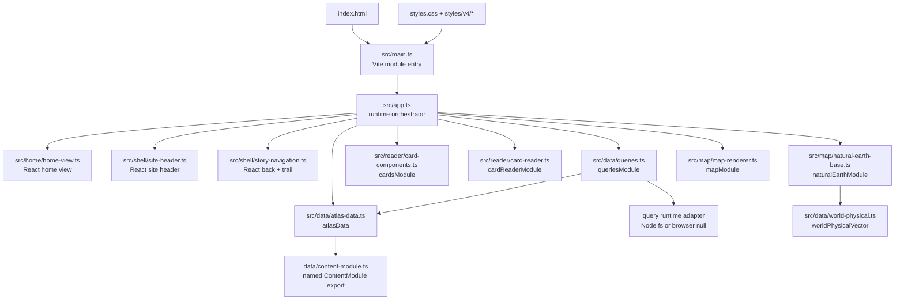
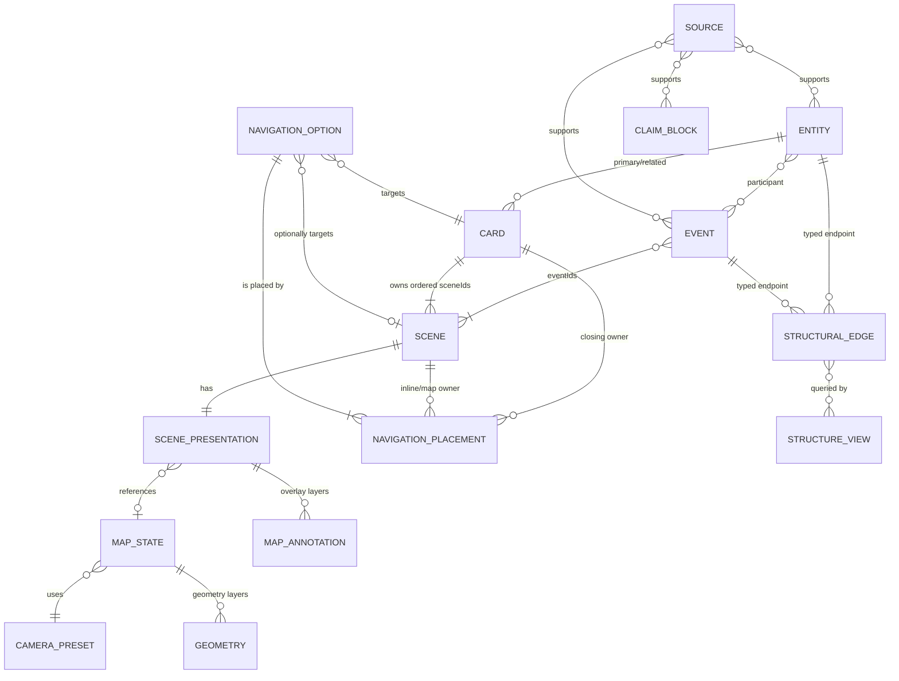
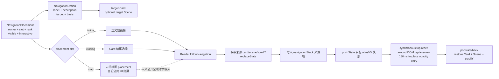

# Civilization Wander：架构与数据模型

> 代码审计基线：2026-08-04。本文以当前可执行入口、查询/校验代码和测试为事实来源。仓库只保留 **schema V5** 运行时。

## 1. 产品目标、边界与核心路径

Civilization Wander 是一个以策展历史故事为中心的静态探索产品。公共体验的稳定目的地是 Card；Card 拥有按顺序阅读的 Scene。读者在 Scene 中认识人物、事件、制度、共同体、政治实体、观念或关系，再沿策展过的入口进入另一张 Card，必要时落到目标 Card 的指定 Scene。

```text
Card → 按顺序阅读 Scene → 发现事件/实体/关系 → 进入另一 Card（可定点到 Scene）
```

地图只是 Scene 的可选呈现，不是内容所有权、路由或导航语义的来源。产品不包含旅游、路线规划、通用 POI、远程地图、时间轴控件或交互式底图。公共文案不暴露 `Entity`、`Card`、`Scene`、`StructuralEdge`、`NavigationOption` 等内部术语。

数据层必须把有来源的历史事实、学术解释、编辑综合、不确定性和叙事过渡区分开。每个完整故事和 Event 都有内部 `EditorialReview`；当前公共 UI 故意不显示它。

## 2. 活动入口、加载顺序与模块依赖

`index.html` 是唯一活动 HTML 入口，通过 `<script type="module">` 加载 `src/main.ts`。Vite 提供本地开发服务器、自动刷新和正式构建；React/React DOM 目前接管首页、品牌 Header、故事返回控件与漫游足迹，组件通过类型化意图回调调用 App，不自行读写 history 或 Reader。App 仍拥有 Card 打开、继续阅读、history 与 Reader 编排。应用编排、React 外壳组件、Cards、Reader、Map、查询、聚合器、本地底图 adapter 与全部正式内容模块均为 TypeScript，Node 文件校验 adapter 仍为 JavaScript。项目不再支持直接双击 `index.html` 或 `file://`，开发预览使用 `pnpm dev`，正式产物由 `pnpm build` 生成到 `dist/`。

`src/data/atlas-data.ts` 的命名导入与有序定义是正式内容模块清单的唯一运行时来源；`src/main.ts` 只导入样式与 `src/app.ts`。`src/app.ts` 再以命名导入取得聚合数据、查询、Cards、Reader、Natural Earth adapter 与 Map，不重复维护内容模块清单。`scripts/check-runtime-manifests.js` 只读检查 HTML 入口、TypeScript 入口、App 依赖图与聚合器，并拒绝重新引入 `ATLAS_*` 运行时全局桥接；文档不保存另一份模块清单。运行时依赖层次是：

1. `src/main.ts`：样式与单一 App 入口
2. `src/app.ts`：运行时模块的唯一编排层
3. `src/data/atlas-data.ts`：直接命名导入 `data/` 下的各内容模块，输出聚合后的 schema V5 数据
4. `src/data/queries.ts`：直接导入聚合数据；Node 直接运行时由 `data/query-node-runtime.js` 提供文件检查，Vite 构建时将它明确替换为 `src/data/query-browser-runtime.ts`
5. `src/reader/card-components.ts` 与 `src/reader/card-reader.ts`
6. `src/map/natural-earth-base.ts`：直接导入 `src/data/world-physical.ts`
7. `src/map/map-renderer.ts`

样式由 `src/main.ts` 按 `styles.css`、`styles/v4/cards.css`、`styles/v4/map.css` 的顺序导入。仓库没有并行历史运行时或发布快照。V5 是当前数据契约；Vite/TypeScript 是构建和开发工作流变化，不构成 schema 版本变化。Cards、Reader 与 Map 的活动代码位于 `src/reader` 和 `src/map`；`styles/v4` 只保留稳定视觉类名，这个目录名不表示活动 schema 仍为 V4。



各内容模块以 TypeScript 命名导出声明精确的十四个数组，不再写入 `globalThis.ATLAS_V5_*` 内容全局变量；其余运行时模块也全部通过命名导入与导出连接，不再以 `ATLAS_*` 浏览器全局变量传递依赖。`src/data/atlas-data.ts` 直接导入这些导出，并在聚合前拒绝缺失、拼错、非数组或未知集合，再输出唯一的 schema 5 顶层数据。`src/types/runtime.ts` 为十四个集合、Claim 判别联合与运行时消费者提供编译期结构契约；它负责尽早发现错误字段和错误类型，但不替代 validator 的引用、唯一性、时间相交和完整性规则。`src/data/queries.ts` 建索引、提供读 API 并执行失败关闭式校验；Node 直接运行时由 `data/query-node-runtime.js` 提供 Asset 文件检查，Vite 则通过显式 alias 使用空的浏览器 adapter，避免把 CommonJS/Node 文件系统代码打进页面。Cards 只负责 HTML；Reader 负责 Card/Scene 生命周期与浏览器历史；Map Renderer 只负责可选地图；`src/app.ts` 是唯一编排层。新增、删除或重排内容模块时只更新聚合器的命名导入与有序定义及受影响测试，并运行 `pnpm run check:manifests`；`src/main.ts` 不维护重复清单。

## 3. 从 `index.html` 到地图渲染器的完整调用链

Vite 从 `src/main.ts` 进入 `src/app.ts`，再由 ES module 依赖图执行各命名导入；聚合器通过命名导入取得全部内容模块并合并数据。全部依赖就绪后，`src/app.ts` 直接使用类型化导入的聚合数据与运行模块，并立即运行 `queries.validateAtlasData()`。任何无法解析的模块依赖、必需 DOM 或无效数据都会在首次渲染前抛错，而不是由 renderer 静默过滤。

初始化链如下：

1. 建立首页板块、Card 容器、返回按钮、标题与面包屑的 DOM 引用。
2. `src/app.ts` 用首页策展配置中的稳定 Card ID 生成三个入口板块；实体名、摘要和 Card 标题始终从当前聚合数据读取，不在首页配置重复维护。首屏提供三个代表性快速起点；可用的本地阅读快照只把第一个动作替换为“继续上次阅读”，其余入口保持稳定。
3. 以命名导入的 `cardReaderModule.createCardReader()` 创建 Reader，注入 `queries`、Cards renderer 以及 Card/Scene/媒体/地图/history 回调。
4. 根据 URL hash 解析 `#card/<cardId>/<sceneId>`；没有有效 Card 时显示首页，直接链接则启动 Reader。
5. Reader 通过 `getCard()`、`getScenesForCard()` 取得 Card 与由 `Card.sceneIds` 决定的 Scene 顺序，再让 Cards renderer 生成主内容。
6. Cards renderer 在标题区从主 Entity 与 Card `timeSpan.start/end` 生成“公共类型 · 主实体名称 · 年代”坐标；每个 Scene 的时间行按 `timeDisplay` 显示年代语义，并从 `Card.sceneIds` 派生“当前位置／总数”。这些都是展示派生值，不写回数据。
7. Reader 为普通导航、预览、IntersectionObserver 和 history 绑定行为；渲染新 Card 时先通知 `onCardChange`，使 `src/app.ts` 在跨 Card 时销毁上一 Card 的媒体，再激活目标 Scene。
8. Scene 激活时，Reader 先按同 Card 顺序解析有效媒体：非 `textOnly` 使用自身 presentation，`textOnly` 继承最近的前序 map/image；没有前序媒体则保持无媒体。随后依次发送 resolved presentation、StructureView 和 MapState。
9. Map Renderer 从 MapState 读取相机与 Geometry，从当前 Scene presentation 读取 Entity/Navigation overlay；Natural Earth 只提供本地底图。
10. Scene 改变时 Reader 用 `history.replaceState()` 更新当前快照；跨 Card 前进导航先保存来源快照，再 `pushState()`，在 DOM 替换前后同步回顶并播放 180ms 原地 opacity 入场。direct/history/popstate 精确恢复不播放该前进动画。

`src/app.ts` 在 Node 环境还暴露首页策展配置、阅读快照规范化函数和 history 辅助函数，供集成测试在没有浏览器 DOM 时验证入口引用、快照边界与历史顺序。Node 22.18+ 可以直接读取其中的可擦除 TypeScript 类型。本地阅读记录使用带 schema 代号的 `civilization-wander:v5:last-read` 键；缺失、损坏或已经失效的 Card/Scene 引用只会隐藏继续入口，不影响核心内容和导航。

## 4. 正式 V5 数据模型：顶层、字段责任与消费者

顶层对象必须是精确的 `{schemaVersion: 5, ...14 collections}`；未知集合、缺失集合或非数组集合均被拒绝。本文只记录集合职责，不手工维护会随内容增长而变化的对象数量。实时数量由聚合后的运行时数据生成：

```powershell
pnpm run report:counts
```

| 集合 | 主要责任 | 主要消费者 |
|---|---|---|
| `entities` | 稳定知识身份；不保存默认 Card | 首页、Cards、导航预览、Map、反向 Card 索引 |
| `events` | 一级历史事件、过程、文本传统或传统叙事，以及参与者与证据 | Scene 完整性、Card 派生事件、关系查询、后续事件产品能力 |
| `structuralEdges` | 可复用的历史关系事实 | StructureView、导航 basis、Map legend |
| `cards` | 公共故事、Scene 所有权和顺序 | Reader、Cards、路由 |
| `scenes` | 有限叙事步骤和可选呈现 | Cards、Reader、Map |
| `structureViews` | 策展关系查询与地图样式上下文 | Queries、Map legend/style |
| `navigationOptions` | 一次跳转的复用语义和目的地 | Cards、Reader、Map |
| `navigationPlacements` | 跳转出现位置、顺序与交互状态 | Cards、Map、校验器 |
| `cameraPresets` | 可复用地图镜头 | MapState、Map Renderer |
| `mapStates` | 可复用地理图层组合 | Scene presentation、Map Renderer |
| `geometries` | 带时间和来源的 GeoJSON 几何 | MapState、Map Renderer |
| `mapAnnotations` | Scene 节点的锚点语义 | Scene map layer、Map Renderer |
| `assets` | 本地图片及其可访问性、来源元数据 | Scene/ClaimBlock、校验器 |
| `sources` | 可复用书目/数据来源 | 所有需要 provenance 的对象 |

### 4.1 通用值对象

表中“必填”按 validator 的精确字段白名单描述；未列出的字段会被拒绝。

| 类型 | 字段 | 必填 | 责任、消费者与关键约束 |
|---|---|---:|---|
| `TimeSpan` | `start`, `end` | 条件 | 至少一个数值端点；有限整数、不得为 0，且 `start <= end`。公元前用负数、公元后用正数。查询和跨对象 overlap 校验消费。 |
|  | `approximate` | 否 | 若有必须为 boolean；表示证据精度，不改变计算规则。 |
|  | `label` | 是 | 非空编辑标签；不是数值范围的替代品。 |
| `Endpoint` | `kind` | 是 | 仅 `entity` / `event`。 |
|  | `id` | 是 | 必须指向与 `kind` 一致的现有对象。 |
| `Source` | `id`, `title` | 是 | 全局唯一 ID、非空标题。 |
|  | `author`, `publisher`, `url` | 否 | 非空字符串；`url` 只是元数据，运行时不会请求。 |
|  | `year` | 否 | 非零整数。 |
| `Asset` | `id`, `type`, `src`, `title`, `alt`, `sourceIds` | 是 | `type` 仅 `data`/`image`，路径须为编码安全的项目内相对路径，禁止协议、绝对路径、盘符与 `..`。Scene 图片统一引用本地 WebP；Node 校验还验证真实文件存在。 |

运行时 Asset 保持精简；creator、license、sourceUrl、origin、原始宽高、编码后宽高、编码后字节数、格式、SHA-256 与审核状态保存在 `assets/images/<module>/manifest.json`，不扩充运行时 schema。manifest 使用 version 2；自动生成的旧素材记录可标记 `needsMetadataAudit`，新模块门禁只接受人工核对后的 `approved`。Scene WebP 必须小于 500,000 bytes，编码后任一边不超过 2560 像素。

### 4.2 知识、事件、关系与故事对象

| 对象 | 字段 | 必填 | 责任、消费者与关键约束 |
|---|---|---:|---|
| `Entity` | `id`, `type`, `name`, `canonicalSummary`, `sourceIds` | 是 | 稳定身份，不拥有或默认跳转到 Card；主/相关 Card 由 Card 字段反向索引。`sourceIds` 非空。 |
|  | `level`, `alternativeNames`, `timeSpan`, `tags` | 否 | `type`/`level` 当前要求非空字符串；若 Entity 被 Card 用作主实体，其 `type` 还必须在公共类型标签表中有稳定中文标签。别名/标签为唯一字符串数组。 |
| `Event` | `id`, `kind`, `title`, `timeSpan`, `participantEntityIds`, `evidenceBlocks`, `sourceIds`, `editorialReview` | 是 | `kind` 仅 `historicalEvent`、`historicalProcess`、`textualTradition`、`traditionalNarrative`；参与者非空且均存在；证据非空，至少一块属于 evidence 语义并有来源；review 必须有效。 |
| `StructuralEdge` | `id`, `family`, `type`, `source`, `target`, `label`, `summaries`, `sourceIds` | 是 | `source`/`target` 为 typed Endpoint 且不得自环；`label.forward`、`summaries.canonical` 必填；来源非空。`branch_of` 两端必须都是 `languageSystem` Entity。 |
|  | `timeSpan`, `qualifiers` | 否 | 用于方向/时间查询与限定；`family`/`type` 当前仅要求非空字符串。 |
| `Card` | `id`, `kind`, `primaryEntityId`, `relatedEntityIds`, `title`, `editorialPurpose`, `introduction`, `thesis`, `timeSpan`, `sceneIds`, `sourceIds`, `editorialReview` | 是 | 公共故事与唯一 Scene 顺序来源。每张 Card 必须有且只有一个主 Entity；该 Entity 必须存在、类型必须有公共标签，且不能在 `relatedEntityIds` 重复。Scene 列表非空；Card Event 按 Scene 顺序去重推导，不在 Card 重复存储；至少 2 个不同来源；至少 2 个 sourced evidence blocks；至少一个归属 Card/Scene 的导航 placement；review 非空。`kind` 当前仅要求字符串。 |
| `Card.thesis` | `text`, `sourceIds` | 是 | 内部核心论点，必须有来源；当前公共 Cards renderer 不显示。 |
| `Scene` | `id`, `title`, `timeSpan`, `eventIds`, `contentBlocks`, `presentation`, `sourceIds` | 是 | 必须恰好出现在一个 `Card.sceneIds` 中；`eventIds` 非空且至少一个 Event 的 `timeSpan` 与 Scene 相交；内容与来源非空；时间须与 owner Card 重叠。没有 `cardId`、`order`、`navigationIds`、`mapStateId` 或 `featuredEntityIds`。 |
|  | `eyebrow` | 否 | 兼容保留的编辑短标签；当前公共 renderer 不显示。 |
|  | `timeDisplay` | 否 | 默认为 `year`，显示 `timeSpan.label`；`undatedNarrative` 固定显示“叙事时间 · 无可考年份”，用于没有可考历史发生年份的史诗或神话内部情节。不得自定义显示文案。 |

### 4.3 ClaimBlock 判别联合

所有 ClaimBlock 都有全局唯一的 `id` 和严格字段白名单。`narrativeTransition` 是唯一不带来源的公共块；内部 `limitation` 只能出现于 `EditorialReview.limitations`。

| `kind` | 精确字段 | 语义与验证 |
|---|---|---|
| `geographyObservation` | `id, kind, text, sourceIds` | 有来源的空间观察；Event evidence 允许。 |
| `historicalFact` | `id, kind, text, timeSpan?, eventIds?, entityIds?, sourceIds` | 来源非空，引用必须存在；Event evidence 允许。 |
| `historicalCase` | `id, kind, title, text, timeSpan?, eventIds, entityIds?, sourceIds` | `eventIds` 与来源非空；作为 Card “两组案例”计数；Event evidence 允许。 |
| `interpretation` | `id, kind, text, attribution?, sourceIds` | 有来源的学术解释；也用于 review 的 uncertainty/alternative explanation。 |
| `editorialSynthesis` | `id, kind, text, sourceIds` | 编辑综合，明确区别于直接事实。 |
| `narrativeTransition` | `id, kind, text` | 只为阅读连续性，不允许伪装成有证据的事实块。 |
| `mechanism` | `id, kind, statement, steps, sourceIds` | 步骤为非空、唯一字符串数组；Event evidence 允许。 |
| `limitation` | `id, kind, text, addressesBlockIds?, sourceIds` | 仅内部 limitations；`addressesBlockIds` 若有必须非空且最终解析到已注册 ClaimBlock。 |
| `sourceNote` | `id, kind, text, sourceIds` | 来源说明。 |
| `asset` | `id, kind, assetId, caption?, sourceIds` | Asset 必须存在，来源非空；图片和数据由消费者按 Asset 类型解释。 |

`EditorialReview` 的精确字段是 `limitations`、`counterexamples`、`uncertainties`、`alternativeExplanations`、`sourceIds`，五项都必填。四类内容至少有一项：分别只接受 `limitation`、`historicalCase`、`interpretation`、`interpretation`；review 来源非空。Card/Event 的 review 是数据和审校层要求，默认公共 markup 的负向测试明确证明它不会泄露到页面。

### 4.4 导航对象

| 对象 | 字段 | 必填 | 责任、消费者与关键约束 |
|---|---|---:|---|
| `NavigationOption` | `id`, `target`, `basis`, `label`, `description` | 是 | 复用跳转身份与文案，不拥有出现位置或排序。所有 Option 必须至少被一个 Placement 使用。可选 `entry: {kind:'targetScene'}` 仅用于已经明确批准的直达段落特例，并要求 `target.sceneId`。 |
| `target` | `cardId`, `sceneId?` | 是/否 | Card 必须存在；Scene 若有必须属于该目标 Card。 |
| `basis` | 见下 | 是 | 四选一严格联合：`{kind:'structuralEdge', structuralEdgeId}`、`{kind:'event', eventId}`、`{kind:'relatedCard', cardId}`、`{kind:'editorial', sourceIds}`。 |
| `NavigationPlacement` | `id`, `navigationOptionId`, `owner`, `slot`, `rank`, `visible`, `interactive` | 是 | 拥有局部出现位置和顺序。`rank` 为正整数，按 owner+slot 从 1 连续且不重复；布尔显示/交互标记由 Cards/Map 消费。 |
| `owner` | `{kind:'scene', sceneId}` 或 `{kind:'card', cardId}` | 是 | Scene 只允许 `inline`/`map`，Card 只允许 `closing`。 |

每个 Scene map navigation layer 必须恰好对应一个该 Scene 的 `slot:'map'` Placement，反向也成立。即使 `visible:false` 或 `interactive:false`，引用、target 和耦合仍必须合法。

### 4.5 Scene presentation、地图与关系视图

| 对象 | 字段 | 必填 | 责任、消费者与关键约束 |
|---|---|---:|---|
| `ScenePresentation` | `{kind:'textOnly'}` | 是 | schema 本身不引用媒体。运行时若同 Card 有最近前序 map/image 则派生并继承它；全 text-only Card、此前无有效媒体或跨 Card 时仍无媒体并使用单栏。此派生不写回数据。 |
|  | `{kind:'image'|'imageAndText', assetId}` | 是 | Asset 必须是本地 `image`；正文 `asset` ClaimBlock 可另行提供内嵌图片。 |
|  | `{kind:'map'|'mapAndText', map}` | 是 | `map` 精确包含 `mapStateId, transition, structureViewIds, layers`。地图不是所有 Scene 的必填项。 |
| `Scene map` | `mapStateId`, `transition`, `structureViewIds`, `layers` | 是 | transition 仅 `hold/ease/cut`；视图 ID 唯一；layers 只接受 Entity/Navigation overlay。 |
| `Entity layer` | `kind, entityId, annotationId, timeSpan?, sourceIds` | 是（时间可选） | Annotation subject 必须匹配 Entity；时间若有须与 Scene 重叠。 |
| `Navigation layer` | `kind, navigationOptionId, annotationId, timeSpan?, sourceIds` | 是（时间可选） | Annotation subject 与 Option 匹配，并满足 map Placement 一一对应。 |
| `CameraPreset` | `id`, `center`, `scale` | 是 | `center=[lon,lat]`；经度 ±180、纬度 Web Mercator ±85.05112878；scale 在 `[0.7,12]`。所有 preset 必须被 MapState 使用。 |
| `MapState` | `id`, `cameraPresetId`, `layers` | 是 | 只拥有可复用 Geometry layer，不能拥有 Scene 专属 Entity/Nav 节点。所有 MapState 必须被 Scene 使用。 |
| `MapState geometry layer` | `kind:'geometry', geometryId, timeSpan, sourceIds` | 是 | 只允许一个主引用；来源非空；layer 时间须与 Geometry 重叠。 |
| `Geometry` | `id`, `geometry`, `timeSpan`, `approximate`, `label`, `sourceIds` | 是 | GeoJSON geometry 仅 Point/MultiPoint/LineString/MultiLineString/Polygon/MultiPolygon；位置经纬度有界，线至少 2 点，环至少 4 点且闭合。近似几何必须有来源；所有 Geometry 必须被使用。 |
| `MapAnnotation` | `id`, `subject`, `anchor`, `anchorMeaning`, `approximate`, `sourceIds`, `placement`, `label?` | 是（label 可选） | subject 为 Entity/Nav；placement 为 9 个显式方位之一；所有 annotation 必须被 Scene layer 使用且 subject 相符。 |
| `StructureView` | `id`, `family`, `title`, `query`, `maxVisible`, `display` | 是 | 查询 StructuralEdge 并影响地图 family 样式与可见 legend 数量；`depth`, `includeEntityIds` 可选。`family/display` 当前只验证为字符串。 |
| `StructureView.query` | `direction` | 是 | `incoming/outgoing/both`；可选 `endpointKinds`, `edgeFamilies`, `edgeTypes`, `timeSpan`，数组非空且唯一。 |

Annotation 的三种地理主张不能混用：

- `locatedAt`：必须是 geo anchor、`approximate:false`、有来源；表示证据支持位于此处。
- `associatedWith`：必须是 geo anchor、`approximate:true`、有来源；表示相关而非精确定位。
- `screenCallout`：必须是 screen anchor；只是界面布局，不作地理声明。

## 5. 校验边界、索引与查询 API

`createQueries(data)` 一次性建立每个正式集合的 `Map<id, object>`，以及由 `Card.sceneIds` 推导的 Scene→Card 反向所有权索引。读 API 包括：

- 单对象：`getEntity/Event/Card/Scene/StructuralEdge/StructureView/NavigationOption/MapState/CameraPreset/Geometry/MapAnnotation/Asset/Source`。
- 所有权/排序：`getOwnerCardForScene()`、`getScenesForCard()`。
- Entity/Card：`getCardsForEntity()`、`getPrimaryCardsForEntity()`、`getRelatedCardsForEntity()`；不再存在 Entity 默认 Card 查询。
- Event/Scene/Card：`getEventsForScene()` 读取作者明确关联；`getEventsForCard()` 按 Card 的 Scene 顺序去重推导。
- 关系：`getEdgesForEndpoint()` 支持 typed endpoint、方向与时间重叠；`getStructureViewItems()` 再按 kind/family/type/time 过滤、优先 include Entity、限制 `maxVisible`。
- 导航：按 Scene/Card + slot 返回局部 rank 排序后的 Placement；`getNavigationOptionsForScene()` 只组合 visible placement 与 Option。
- 时间：`timeSpanOverlaps()` 同时支持 BCE、CE 与单边范围。
- 数据：`validateAtlasData()` 包裹所有检查，恶意/畸形嵌套值也只返回 `{valid:false, errors}`，不会把异常抛到调用方。

校验器还执行全局 ID 唯一性、引用类型匹配、未知字段拒绝、对象孤儿检查、Scene 唯一所有权、Scene—Event 时间相交、Card 派生 Event、Card 完整性、导航 rank 连续、地图/Scene/Geometry 时间重叠、Annotation 联合一致性以及本地 Asset 存在性。当前通用孤儿检查覆盖 Event、NavigationOption、CameraPreset、MapState、Geometry、MapAnnotation、StructureView、Asset；Entity、StructuralEdge、Card、Scene、Source 依靠各自引用和完整性规则而没有一条统一“必须被消费”规则。

## 6. 对象关系与唯一权威来源



必须坚持的权威边界：

- `Card.sceneIds` 是 Scene 所有权和顺序的唯一来源；Scene 不反向保存 `cardId/order`。
- `NavigationOption` 拥有语义和 target；`NavigationPlacement` 拥有 owner/slot/rank/可见性/交互性。
- `MapState` 拥有可复用 Geometry 与 CameraPreset；Scene presentation 拥有当下 Scene 的 Entity/Nav 节点。
- `Source` 应尽可能下沉到 ClaimBlock、Event evidence、layer、Geometry 或 Annotation；Card/Scene 的 sourceIds 是汇总，不替代论断级引用。

## 7. Scene 激活到地图更新的事件时序

```mermaid
sequenceDiagram
    participant U as "读者/Hash/Observer"
    participant R as "V5 Reader"
    participant C as "Cards Renderer"
    participant A as "src/app.ts"
    participant Q as "V5 Queries"
    participant M as "Map Renderer"
    participant H as "History API"

    U->>R: "start/open/scroll activates Scene"
    R->>Q: "getCard + getScenesForCard"
    R->>C: "renderMainCard(card, scenes)"
    C-->>R: "semantic markup + media slot + nav"
    R->>A: "onCardChange; reset media only across Cards"
    R->>R: "announceScene; derive direction/trigger; resolve own or prior media"
    R->>A: "onPresentationChange(resolved presentation)"
    alt "resolved textOnly: no earlier same-Card media"
        A->>A: "hide media; single-column reading"
    else "resolved image: own or inherited"
        A->>A: "retain map/render image overlay, or retain same image"
    else "resolved map: own or inherited"
        A->>A: "ensureMap(current media slot)"
        R->>A: "onStructureViewsChange(viewIds)"
        A->>M: "setStructureViews()"
        M->>Q: "getStructureViewItems()"
        R->>A: "onMapStateChange(mapStateId, scene config)"
        A->>M: "renderMapState()"
        M->>Q: "camera + geometry + annotations + placements"
        M->>M: "animate latest layers, or retain inherited state"
    end
    R->>H: "replaceState(cardId, sceneId, scrollY)"
```

首次 `renderCard()` 会先写 markup、绑定导航/预览、通知 Card 变化，再创建 IntersectionObserver 并激活 direct/fallback Scene，必要时聚焦 `h1`。普通滚动只重新执行 `announceScene()`。Observer 以视口约 44% 处为阅读锚，使用 `rootMargin: -28% 0 -52%` 与阈值 0/0.2/0.6；不支持 IntersectionObserver 时使用直接回退。

`deriveSceneDirection()` 和激活 context 在运行时派生 `forward/backward/stationary` 方向与 `scroll/direct/navigation/history` 触发原因；`inheritedMedia`、`presentationScene` 等也只存在于 Reader state/callback context，绝不进入 V5 Scene schema。同 Card 的 `textOnly` 继承最近前序有效媒体，直接链接到它也按相同顺序解析；跨 Card 由 `onCardChange` 销毁媒体，全 text-only Card 或此前无媒体保持单栏。同 Card 内地图实例保持常驻，图片作为覆盖层渐显，回到地图时覆盖层渐隐并移除，相同图片保持原 DOM，reduced motion 时立即切换。Reader 仅预加载当前 Scene 前后最近的不同图片，不预取全库；图片切换保留当前媒体，直到新图完成加载和解码后才开始淡入。公共正文保持连续排版：historical case、mechanism 等仍有语义化 markup，但不再卡片化；Scene 内只有策展导航卡片保留边框/背景。

Reader 用生命周期 `generation`、前进入场 `sequence` 和逐次渲染 `renderSequence` 守卫异步工作。`destroy()` 先使生命周期失效，再断开 observer、清理 timer/preview/替换状态；旧 rAF、timer、preview 与 scroll restore 回调随后即使被调度也不能再写 DOM 或滚动页面。新的 Card render 还会使较早 history restore rAF 的 `renderSequence` 失效。

## 8. 地图投影、镜头、几何与节点更新

地图是一个固定 `viewBox="0 0 1000 700"` 的本地 SVG。`src/data/world-physical.ts` 提供 4096 坐标空间的 Natural Earth 数据，adapter 在初始化时一次性拆分陆地子路径，并为陆地、全部湖泊和全部 rank≤6 河流缓存路径范围。renderer 汇总当前 Card 所有地图 Scene 的 CameraPreset，以这些镜头范围的并集各生成一个地区陆地、湖泊和河流 SVG 路径；同 Card 的 Scene 切换只移动镜头和更新历史覆盖层，不再改写底图路径。这样既避免任意数量截断破坏河网连续性，也不绘制完整世界底图。运行时没有 tile、字体、影像或 API 请求，也没有拖拽、滚轮缩放、平移或底图切换控件。

`projectPoint()` 使用 Web Mercator 并限制纬度；`geometryToPath()` 支持六种正式 GeoJSON geometry。`cameraTransform()` 把 CameraPreset center 投到 4096 空间，以 SVG 中心 `(500,350)` 对齐，并按 `scale * 1000 / worldSize` 计算变换。几何 path 按 ID 缓存。

镜头 transition 的运行语义：

- `cut`：首次进入、direct link 与 history 恢复时立即应用；相邻 Scene 由普通滚动触发时转成 200ms 的镜头动画。
- `ease`：相机过渡 420ms；用户偏好 reduced motion 时有效模式降级为 `cut`，数据不被改写。
- `hold`：首次没有相机时等价 `cut`；已有相机时保留前一 preset/transform，但 Geometry 仍交叉切换；节点和 legend 继续在内部更新但不公开显示。

Natural Earth 底图在 map 实例生命周期内只创建一次；变化只发生在相机和 historical Geometry、节点、legend 三类 overlay。节点、legend 与右下角近似说明由 renderer 保留以维持数据消费和校验路径，但当前 CSS 全部隐藏，公共地图只显示底图与历史 Geometry。每类 overlay 分别记录 `committed`（已在 DOM）与 `desired`（最新目标）markup：目标未变时不重写 DOM，只有变化项执行两阶段 150ms crossfade。A→B 尚未提交就回到 A 时会取消 B timer；由于 A 仍是 committed，离场 class 立即撤销且 DOM 不重写，旧 callback 即使到达也会因 desired 不匹配而失效。

上下相邻 Scene 的普通滚动以 200ms 镜头动画连接 `cut` 地图，并只动画真实变化的叠层；明确的 `ease` 仍使用 420ms，继承同一媒体时直接保留，reduced motion 时禁用相机和叠层动画。`clear()`/`destroy()` 都取消待处理 overlay timer，清空 committed/desired 状态并移除旧层；`destroy()` 还清空容器、几何缓存与相机状态。

MapState 先渲染带时间/来源的 Geometry；Scene map layers 仍把 Annotation 转成内部节点。geo annotation 经相机投影成百分比位置，screenCallout 使用明确屏幕 placement，Map navigation 节点仍检查当前 Scene 的 map Placement 的 `visible/interactive`，但节点容器不公开显示。StructureView 通过四个 family（lineage/composition/context/historicalNetwork）改变 Geometry 的 CSS family 状态、必要时添加线箭头，并在隐藏的 legend DOM 中保留实际查询条数；它尚不把查询出的每条 edge 绘成单独图元。

## 9. Option/Placement 分离与导航状态流



普通 `<a href="#card/.../...">` 始终保留静态 fallback；JavaScript 只增强预览、快照和聚焦。跨 Card 前先把当前活动 Scene 与 `scrollY` 写回当前 `atlasV5` 历史项，再 push 目标项。前进导航把 `scrollingElement`、`documentElement`、`body` 与 window 同步设为 0，并在 Card DOM 替换前后各执行一次；替换窗口继续使用稳定 CSS 类 `is-v4-card-replacing` 暂时关闭 scroll anchoring。全局 `scroll-behavior:auto` 保证回顶不被平滑滚动延迟。

只有 `trigger:'navigation'` 播放 180ms 原地 opacity 入场，不使用 `translateY`；direct、Scene 滚动、history/popstate 与精确 scroll restoration 不套前进动画，`prefers-reduced-motion` 也完全禁用它。history restore 在 DOM 就绪后的 rAF 精确恢复 `scrollY`，并以 `renderSequence` 拒绝较早 render 遗留的回调。`popstate` 只接受 `atlasV5` 快照或当前 hash；无效或不属于目标 Card 的 Scene 确定性回退到 Card 第一 Scene。

首页转场也先保存可见 Card 快照，且只在当前 history state 是 `atlasV5` 时保存，避免用首页状态覆盖陈旧 Card。首页 state 使用 `atlasHome:true`。

## 10. 来源、历史事实、推论与内部审校如何绑定

来源有三层绑定，但下层优先：

1. `Source` 保存可复用书目/数据 provenance；URL 不会触发请求。
2. `sourceIds` 直接附着于 ClaimBlock、Event evidence、StructuralEdge、Geometry、map layer、Annotation 等具体主张。
3. Entity/Card/Scene/Event 的 sourceIds 用于对象级汇总和完整性验证，不能替代具体论断来源。

`historicalFact`/`historicalCase` 表示来源支持的事实或案例，`interpretation` 表示有归属的解释，`editorialSynthesis` 表示编辑综合，`narrativeTransition` 只负责叙事连续。Event evidence 只接受 geography observation、historical fact/case、interpretation、mechanism 等证据语义，且至少一块有来源。

公共 Scene 中原有“Natural Earth 本地矢量底图来源说明”ClaimBlock 及为它保留的孤立 Asset 已从数据源删除，而不是由 renderer/CSS 隐藏；`source-natural-earth` 仍作为内部 Source 被 Geometry 与 map layer 引用，因此地图 provenance 没有丢失。

限制、反例、不确定性和替代解释进入内部 `EditorialReview`，不得塞进公共 prose 后再靠关键词判断。当前 UI 同样没有渲染来源脚注；数据已具备论断级绑定，但公共 citation 体验仍是后续工作。

## 11. 时间数据如何流经查询、校验与呈现

时间用整数年份计算：BCE 为负，CE 为正，不存在 0 年；`label` 承载可读文本，`approximate` 标记精度。Entity、Event、StructuralEdge、Card、Scene、Geometry、MapState layer 以及部分 Scene overlay layer 都可以或必须携带 TimeSpan。

数据进入查询/呈现的路径是：

```text
数值 TimeSpan
  → validator 检查有限整数/顺序/跨对象 overlap
  → getEdgesForEndpoint / StructureView 按 overlap 筛选
  → 当前 Scene 决定可用 MapState、Geometry layer 与 overlay
  → UI 在每个 Scene 上方统一显示 timeSpan.label，并显示标题与正文
```

当前没有公共 timeline。Scene renderer 默认把 `TimeSpan.label` 显示为标题上方的年代小字；`timeDisplay: 'undatedNarrative'` 则显示固定文案“叙事时间 · 无可考年份”。Scene label 仍由数值 `start`／`end` 写成纯年份并保留在数据中，不承载王朝、世纪、考古阶段或文本传统等背景说明。时间同时用于语义一致性与查询边界；地图镜头本身不携带时间，不能被误读为历史锚点。

## 12. 新增 Entity、Event 与 StructuralEdge

1. 先新增至少一个可复用 Source，或确认已有 Source 真正支持主张。
2. 新 Entity 填 `id/type/name/canonicalSummary/sourceIds`，必要时填 `timeSpan`；不要伪造精确存在期，也不要添加默认 Card。Card 索引由 `primaryEntityId` 与 `relatedEntityIds` 反向生成。
3. 新 Event 填准确 `kind`、可计算 `timeSpan`、非空 participants、typed evidence blocks、来源和内部 review。晚期传统叙述使用 `textualTradition` 或 `traditionalNarrative`，不能当作同时代证据。
4. 新 StructuralEdge 选择真实 `family/type`，用 typed `source/target` 指向 Entity 或 Event，写方向性 label、canonical summary、来源和可辩护的时间；不要为了连图自动暴露所有关系。
5. 若关系需要出现在地图语境中，复用或新增 StructureView 过滤；如果它应触发跳转，再单独建 NavigationOption，不能把 edge 当 Placement。
6. 运行 V5 数据校验、内容/查询测试与负向测试；确认每个 Scene 至少关联一个时间相交 Event，且不存在自环、错误 endpoint kind、无来源 evidence 或孤儿 Event。

## 13. 新增 Card、Scene 与导航

1. Card 先确定简洁公共标题、内部 editorial purpose、不过度主张的 sourced thesis、相关 Entity/Event、可计算时间、至少两个来源和非空 review。
2. 为 Card 策展有意义的 Scene，每个只表达一个有限历史情境或解释步骤。Scene 写 typed content blocks、sourceIds、timeSpan 与 presentation；没有空间价值时使用 `textOnly`。
3. 只在 `Card.sceneIds` 写所有权和顺序；不得给 Scene 增加 `cardId/order`。
4. 全 Card 的 Scene 合计至少两个不同的 sourced `historicalCase`，并与 Card 时间重叠。
5. 每个下一步先建立一个 NavigationOption：target Card 必填，只有确需定点阅读时才加 target Scene；basis 必须能解释为什么值得进入下一视角。
6. 再建立 Placement：正文用 Scene+inline，地图用 Scene+map，结尾用 Card+closing；每个 owner+slot 的 rank 从 1 连续。相同 Option 可多处复用，不重复储存 hook/summary。
7. 检查普通链接 fallback、直接 hash、无效 Scene 回退、键盘焦点、返回/前进和 scroll restoration。

## 14. 新增 Geometry、MapAnnotation、CameraPreset 与 MapState

1. 只有空间关系实质帮助当前 Scene 时才加地图。先判断需要范围、路线、分布还是屏幕说明。
2. Geometry 使用受支持的 GeoJSON 类型，给出可辩护的 TimeSpan、label、`approximate` 和来源。手绘边界/教学路线必须保持 `approximate:true`；环要闭合，坐标精度不得高于证据。
3. CameraPreset 只表达构图，center 不是历史定位。优先复用现有 preset；scale 必须在 `[0.7,12]`。
4. MapState 只组合 `cameraPresetId` 与 geometry layers，每层有自身 timeSpan/sourceIds；不得把 Entity/Nav 节点放入 MapState。
5. 在 Scene presentation 里引用 MapState，选择 `hold/ease/cut`，列出 StructureView，并用 Scene map layers 放当下节点。
6. 每个节点建 MapAnnotation。没有直接位置证据一律使用 `screenCallout`；有相关但非精确位置使用 sourced、approximate `associatedWith`；只有证据支持精确位置才用 sourced `locatedAt`。
7. 每个 Nav layer 同时建立同 Scene 的 map Placement；校验 Geometry/layer/Scene 时间重叠、subject 一致和无孤儿对象。

## 15. 新增 historical case、内部限制与来源

历史案例应建为 `historicalCase`，包含标题、文本、至少一个 Event ID、可选 Entity/timeSpan 和非空来源。若案例构成新一级事件，不要只留在段落里：先建 Event，再由 case 与 Card 引用它。

内部限制按其真正语义放入 Card 或 Event review：

- 方法/范围限制：`limitations` 中的 `limitation`，必要时用 `addressesBlockIds` 指向被限定的公共/证据块。
- 反例：`counterexamples` 中的 sourced `historicalCase`。
- 证据不确定：`uncertainties` 中的 sourced `interpretation`。
- 竞争解释：`alternativeExplanations` 中的 sourced `interpretation`。

所有 review 还要有对象级 `sourceIds`。不要为了满足校验复制公共结论，也不要把 review 默认渲染给用户。

## 16. 一套完整的内容接入流程

建议按以下顺序编辑，能最早暴露引用和所有权错误：

1. Sources 与本地 Assets。
2. Entities 与 Events。
3. StructuralEdges 和必要的 StructureViews。
4. Card 元数据、thesis、review。
5. Scenes 与 typed ClaimBlocks。
6. Card.sceneIds 唯一顺序。
7. NavigationOptions，再到 Placements。
8. 仅在必要时加入 CameraPreset、Geometry、MapState、MapAnnotation 与 Scene map layers。
9. `pnpm typecheck` 与 `node --check` 活动脚本。
10. `queries.validateAtlasData(data)` 并审阅精确 counts/errors。
11. 运行数据、UI、地图、集成和 E2E 全套 V5 测试。
12. 通过 `pnpm dev` 或 `pnpm preview` 做真实浏览器检查：桌面/移动、直达 Card/Scene、滚动 Scene、返回/前进、刷新、键盘、reduced motion、控制台与失败请求。

任何 schema 变更都必须显式升级版本、给出迁移策略、同步 validator，并增加证明坏数据被拒绝的负向测试。Renderer 不能成为坏数据的过滤器。

运行时路径或加载顺序、内容生产阶段数量、Preview/导航/history 等交互契约发生变化时，README、本文、固定测试清单和受影响的工作规范必须在同一任务中同步；缺少这一步的实现不视为完成。文档与执行证据冲突时，以活动入口、validator、实际运行时数据、可执行代码和聚焦测试为准；若测试之间或测试与入口冲突，应把过时测试本身作为漂移修复，而不是选择性引用。

## 17. 测试、数据校验与验收运行方法

项目没有运行时 dependencies；开发与构建使用 Vite、TypeScript 和 Node 类型定义，要求 Node >=22.18，推荐 Node 24 LTS，包管理器与锁文件以 pnpm 为准。首次运行先执行 `corepack enable` 和 `pnpm install`。标准命令：

```powershell
pnpm typecheck
pnpm test
pnpm run test:data
pnpm run test:ui
pnpm run test:map
pnpm run test:integration
pnpm run test:e2e
pnpm run check:syntax
pnpm run check:manifests
pnpm run check:pages
pnpm run report:counts
pnpm build
pnpm run test:browser:install # 每台机器首次运行一次
pnpm run test:browser
```

若 `node`/`pnpm` 未加入 PATH，可直接调用本机 Codex runtime 的 Node 与 pnpm，再传递 `package.json` 中相同参数。本文不保存某次运行的测试数量、通过数量、首载字节数或集合计数；这些结果必须在验收时由当前命令重新生成。

全套 Node 测试覆盖 V5 schema/content/query/validation、独立内容模块汇总、Asset manifest、Cards/Reader、Map、E2E、应用 history、媒体继承与跨 Card 重置、图片比例与淡入淡出、地图覆盖 UI 隐藏、同步回顶、异步 restore 失效、overlay 差量与反转竞态、Vite 入口与聚合器单一内容清单、Pages 构建约束和 reduced motion。`pnpm test:browser` 则用真实 Chromium 打开 `dist/`，检查首页、Card 进入、Scene 滚动激活、主要图片、控制台错误和关键资源失败。

自动化生产浏览器门禁覆盖关键冒烟路径，但不能代替第 16 节第 12 项中的完整桌面、移动、历史导航、键盘和 reduced-motion 人工验收；不要把 Node 模拟、静态检查或单条浏览器冒烟测试写成全量实机通过。

## 18. Vite、静态部署与地图产物约束

- `index.html` 只加载 `src/main.ts`；入口只导入样式与 `src/app.ts`，App 通过命名导入拥有完整运行时依赖图，内容模块只由聚合器接入。后续重构不得绕过聚合器、validator、清单一致性检查或重新引入运行时全局桥接。
- 不得为核心内容请求远程地图、字体、API 或图片。Source URL 只是元数据。
- URL 主身份保持 `#card/<cardId>/<optionalSceneId>`；Scene ID 用于区段定位和恢复，不成为全局故事节点。
- `vite.config.mts` 使用 `/civilization-wander/` 作为 GitHub Pages 项目路径；`pnpm build` 将应用与本地运行时资源输出到 `dist/`，并复制 `.nojekyll`。
- `.github/workflows/deploy-pages.yml` 在 `main` 推送后执行测试、构建与生产 Chromium 验收；只有全部通过才发布 Pages，失败时保存 Playwright 报告和追踪。Pages 来源必须设置为 GitHub Actions，不能再直接托管仓库根目录。
- 当前地图产物是 `src/data/world-physical.ts` 和 `src/map/natural-earth-base.ts`：前者保存本地 Natural Earth 矢量数据，后者负责筛选、冻结和缓存。两者都是受版本控制并接受 TypeScript 检查的运行时产物；运行时内容图片位于 `assets/images/` 并统一编码为 WebP，当前仓库不包含地图上游原料或构建链。

## 19. 已知限制与未来演进方向

1. Event 已是一级数据和查询对象，但没有独立公共路由或 Event 页面；当前通过 Card 与关系被发现。
2. 来源已下沉到 ClaimBlock/证据/地图对象，公共 UI 尚未显示行内 citation 或来源面板。
3. 新增图片仍须使用本地 WebP Asset，并通过文件存在性、体积、尺寸、alt 与 provenance 校验；Scene 媒体按原比例居中完整显示，余白使用 `#c8cbbb`。
4. MapAnnotation 必须保持 `locatedAt`、`associatedWith` 与 `screenCallout` 的语义区分；新增地理锚点仍需人工史料审查。
5. StructureView 查询结果目前只驱动 Geometry family 样式和隐藏 legend 的内部计数，不逐 edge 绘制；`depth` 与 `display` 没有进一步运行语义。
6. V5 validator 对一般 Entity.type、Card.kind、StructuralEdge family/type、StructureView family/display 仍主要做非空字符串检查；但 Card 主 Entity 的类型必须存在于公共类型标签表，Event.kind 已收紧为显式 enum。Map 对未知 family 不会提供完整语义样式。未来若其余类型集合稳定，应收紧为显式 enum 并加迁移/负测。
7. `map` 与 `mapAndText`、`image` 与 `imageAndText` 在当前主阅读布局中差异有限；类型为未来呈现保留，不能据此复制内容。
8. Reader 的 `navigationStack` 是漫游足迹的运行态来源，并复制进每个浏览器 history snapshot；popstate 会从目标快照恢复它，使足迹与返回位置一致。它不是 runtime 内容 schema。`entryContext` 只承载方向、触发原因和媒体继承等瞬时呈现上下文，不持久化。浏览器 history snapshot 仍是返回、足迹和滚动恢复的权威。
9. Scene 方向与媒体继承依赖当前 Card.sceneIds 和运行态激活顺序；它们没有 schema 字段。若未来需要可编辑的非线性 Scene 顺序，必须先设计正式模型，不能持久化当前派生 context。
10. 活动本地底图与聚合内容仍使主 JavaScript 构建块较大；可在不引入远程运行时依赖的前提下继续压缩、分层或按页面需求拆分，但必须保持直达链接和首次渲染正确。
11. 没有内容编辑器或 schema 生成器；V4→V5 提供一次性、显式映射的 `scripts/migrate-v4-content-to-v5.js`，后续破坏性变化仍须各自提供版本与迁移策略。数据维护依赖严格 validator 与测试。

## 20. 文件职责总表

### 20.1 活动运行时与项目入口

| 文件 | 当前职责/状态 |
|---|---|
| `index.html` | 活动 V5 页面、语义 landmark 与单一 Vite module 入口。 |
| `src/main.ts` | 按固定顺序导入样式，并加载唯一的 `src/app.ts` 运行时入口。 |
| `src/app.ts` | 通过命名导入拥有完整运行时依赖图，并负责 React 首页视图模型、Card 打开、Reader/Map 接线、媒体切换、快照与 history 辅助。 |
| `src/home/home-view.ts` | React 首页组件与类型化视图模型；只负责首页 DOM，不拥有 Reader、history、localStorage 或地图状态。 |
| `src/shell/site-header.ts` | React 品牌 Header；保留稳定的首页链接属性，点击行为仍由 App 编排。 |
| `src/shell/story-navigation.ts` | React 返回控件与漫游足迹；App 继续拥有 history、Reader 状态和返回决策。 |
| `src/types/runtime.ts` | 十四个内容集合、Claim 判别联合、App/Queries/Cards/Reader/Map 与必要浏览器 API 外观的编译期结构契约；不保存运行时模块全局变量，语义规则仍由 validator 执行。 |
| `vite.config.mts` | GitHub Pages base、正式构建和本地运行时 Asset 复制。 |
| `tsconfig.json` | TypeScript 运行时与正式内容模块的类型检查边界；Node 支持脚本和测试仍由各自的 JavaScript 检查覆盖。 |
| `package.json` | Node≥22.18、pnpm、Vite 开发/构建命令与分层验证脚本。 |
| `styles.css` | 全局 shell、首页、焦点、响应式与 reduced-motion 基线。 |
| `styles/v4/cards.css` | V4 Card/Scene/claim/navigation/preview/媒体布局。 |
| `styles/v4/map.css` | V4 SVG 底图、Geometry family、节点、legend、移动/reduced-motion。 |

### 20.2 活动 V5 数据、查询、UI 与地图

| 文件 | 当前职责/状态 |
|---|---|
| `data/<content-module>.ts` | 按主题拆分的正式内容模块：来源、Entity、Event、Card、Scenes、导航、可选地图配置与图片 Assets。每个模块以 TypeScript 命名导出提供精确十四集合，不写入内容全局变量；清单与顺序由聚合器维护。 |
| `src/data/atlas-data.ts` | 以类型化边界严格检查模块接口，汇总内容模块并输出 schema 5 的 14 个正式集合。 |
| `src/data/queries.ts` | V5 索引、派生 Entity/Card 与 Card/Event 查询及严格 validator。 |
| `data/query-node-runtime.js` | 为 Node validator 提供 Asset 文件存在性检查；仅供 Node 直接运行时使用。 |
| `src/data/query-browser-runtime.ts` | Vite 明确替换使用的空浏览器 adapter，防止 CommonJS/Node 文件系统代码进入生产页面。 |
| `scripts/report-atlas-counts.js` | 只读加载聚合数据并报告当前 schema 与各集合数量，不修改数据或文档。 |
| `scripts/check-runtime-manifests.js` | 只读检查 HTML/TypeScript 入口、App 命名导入图与聚合器，确认聚合器是唯一内容模块清单，并拒绝旧式运行时全局桥接。 |
| `scripts/validate-content-module.js` | 对 staging 模块执行精确接口、局部 ID／引用、pending sibling 声明、Asset manifest 与媒体决策门禁。 |
| `scripts/content-module-runtime.js` | 从聚合器命名导入读取真实内容模块文件名，并统一解析唯一的十四集合命名导出；避免测试和维护脚本另存模块清单。 |
| `scripts/generate-asset-manifests.js` | 从现有运行时 Asset 更新 version-2 非运行时元数据清单、编码尺寸、体积和摘要；保留既有审核字段，不猜测许可。 |
| `scripts/migrate-v4-content-to-v5.js` | 记录 V4→V5 的显式字段删除、Event kind 和逐 Scene Event 映射。 |
| `assets/images/<module>/manifest.json` | 保存运行时 schema 之外的媒体来源、许可、创作者、原始与编码尺寸、体积、WebP 格式、origin、SHA-256 与审核状态。 |
| `src/reader/card-components.ts` | 类型化并语义转义后的 Card、连续 Scene prose、ClaimBlock、带框导航 Placement 与预览 HTML；以 `cardsModule` 命名导出供 App 使用。 |
| `src/reader/card-reader.ts` | 类型化的 Scene 方向/媒体派生、观察器、hash/history/瞬时 scroll restoration、前进入场与异步生命周期守卫；以 `cardReaderModule` 命名导出供 App 使用。 |
| `src/map/map-renderer.ts` | 类型化的本地 SVG 投影、连续相机/overlay transition、Geometry、Scene 节点、StructureView legend 与竞态清理；以 `mapModule` 命名导出供 App 使用。 |
| `src/data/world-physical.ts` | 活动生成、受 TypeScript 接口约束并以 `worldPhysicalVector` 命名导出的 Natural Earth 4096 坐标底图数据。 |
| `src/map/natural-earth-base.ts` | 直接导入底图数据的 TypeScript adapter、筛选、冻结与缓存；以 `naturalEarthModule` 命名导出供 App 使用。 |
| `playwright.config.ts` | 正式构建的 Chromium 验收配置、Pages 子路径与失败报告策略。 |
| `tests/browser/production-smoke.spec.ts` | 首页进入 Card、Scene 滚动、图片加载、控制台与关键资源错误的生产冒烟验收。 |

### 20.3 测试与 fixture

| 文件 | 覆盖责任 |
|---|---|
| `tests/data-v5/schema.test.js` | V5 顶层/所有权/地图分责/全局 ID。 |
| `tests/data-v5/content.test.js` | 完整 Card、Scene Event、Claim 来源、review 隔离、Natural Earth provenance、图片放置与 Annotation 内容。 |
| `tests/data-v5/queries.test.js` | Scene 顺序、派生 Entity/Card 与 Card/Event、edge、Placement、时间、StructureView。 |
| `tests/data-v5/validation.test.js` | 畸形数据、未知字段、Scene Event、所有权、review、时间、地图、资产等系统负测。 |
| `tests/data-v5/asset-manifest.test.js` | Asset manifest 覆盖、WebP 格式、文件摘要、编码尺寸与全体图片大小上限。 |
| `tests/ui-v4/cards.test.js` | V4 Cards/Reader、正文视觉、同 Card 媒体继承、方向派生、前进/恢复、destroy 竞态、hash/history/scroll。 |
| `tests/map-v4/map.test.js` | 投影/路径、direct/history/相邻 Scene camera、overlay 差量/crossfade/反转、reduced motion、竞态清理。 |
| `tests/e2e/v5-flows.test.js` | V5 两次返回、textOnly 直链继承前序媒体、全部现有故事可读。 |
| `tests/integration/app-history.test.js` | Card→home→Card 的快照顺序，以及媒体同 Card 保留/跨 Card 重置。 |
| `tests/integration/runtime.test.js` | 活动 V5 入口隔离、清单一致性、validate-first、品牌/回调/可访问性静态契约。 |
| `tests/integration/pages.test.js` | Vite 单入口、本地导入、无远程运行时、Pages base/Asset 复制与 package scripts。 |
| `tests/fixtures/local-image.svg` | image presentation/Asset 负测与边界校验 fixture。 |

### 20.4 说明与配置

| 文件 | 当前职责/状态 |
|---|---|
| `AGENTS.md` | 当前产品、编辑、数据和工程约束。 |
| `README.md` | V5 运行、内容范围、架构和维护入口。 |
| `docs/ARCHITECTURE_AND_DATA_MODEL.md` | 本文；正式字段、运行调用链和内容接入手册。 |
| `.github/workflows/deploy-pages.yml` | 测试、构建、运行生产浏览器门禁并将通过验收的 `dist/` 发布到 GitHub Pages。 |
| `.nojekyll` | 构建时复制到 Pages 产物，避免 Jekyll 处理。 |
| `.gitignore` | 仓库忽略规则。 |

遇到冲突时采用以下证据优先级：活动 `index.html`、`src/main.ts`、聚合器、构建配置与 `package.json` → 可执行 validator/query/renderer/Reader 与一致性脚本 → 当前测试 → 本文与 README。本文不是 schema 执行器；代码变更后必须同步更新，而不是让文档替代校验器。
